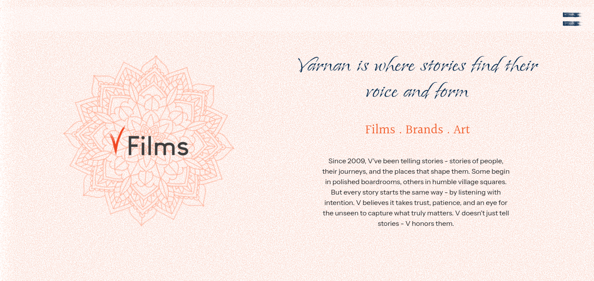
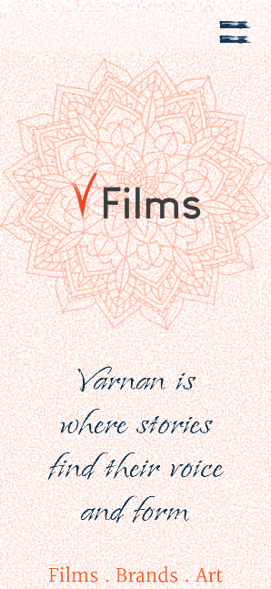

# 🎬 VFILMS - Front-End Intern Test Submission 


A **single-page responsive web application** built with **React + Vite**, based on the Figma design provided in the EZ Labs Front-End Intern Test.

---

## 🧠 Overview

This project focuses on **UI implementation**, **responsiveness**, and **API integration**.  
It recreates the **Home Page** design (as per the provided Figma) and integrates a **Contact Form** that sends user details to the provided backend endpoint.

---

## 🧩 Features

✅ Pixel-perfect UI inspired by Figma Design  
✅ Fully Responsive (Mobile, Tablet, Desktop)  
✅ Contact Form with Validation (name, email, phone, message)  
✅ Integrated API via **Axios**  
✅ Form feedback messages (“Form Submitted”, validation errors, etc.)  
✅ Clean, Modular, and Maintainable File Structure  
✅ TailwindCSS-based design system

---

## 🛠️ Tech Stack

| Category    | Technology                               |
| ----------- | ---------------------------------------- |
| Framework   | [React 19 (Vite)](https://vitejs.dev/)   |
| Styling     | [Tailwind CSS](https://tailwindcss.com/) |
| HTTP Client | [Axios](https://axios-http.com/)         |
| Linting     | ESLint                                   |
| Router      | React Router 7                           |

---

## ⚙️ Project Setup

### 1️⃣ Clone the repository

```bash
git clone https://github.com/abhishekkumar190804-web/vfilms.git
cd vfilms
```

### 2️⃣ Install dependencies

```bash
npm install
```

### 3️⃣ Run the development server

```bash
npm run dev
```

### 4️⃣ Build for production

```bash
npm run build
```

### 5️⃣ Preview the build

```bash
npm run preview
```

---

## 🔑 Environment Variables

Before running the app, create a `.env` file in the **root directory** of your project:

```bash
VITE_API_CONTACT=use-your-custom-api-here-or-end-point-mentioned
```

---

## 🌐 API Integration

**Endpoint:**  
`POST https://vernanbackend.ezlab.in/api/contact-us/`

**Example Request:**

```json
{
  "name": "Test user",
  "email": "testuser@gmail.com",
  "phone": "908765498",
  "message": "This is a message"
}
```

**Expected Response (200/201):**

```json
{
  "created_at": "2025-10-10T05:27:59.371578Z",
  "email": "testuser@gmail.com",
  "id": 49,
  "message": "This is a message",
  "name": "Test user",
  "phone": "908765498",
  "updated_at": "2025-10-10T05:27:59.371598Z"
}
```

**Validation Rules:**

- All fields required
- Email must be valid
- Empty submission blocked

---

## 📁 Folder Structure

```
.
├── eslint.config.js
├── index.html
├── package.json
├── postman-dump.json
├── public/
│   ├── icons and manifest files
├── src/
│   ├── assets/ → images, svgs, fonts
│   ├── components/ → reusable UI components
│   ├── config/ → configuration files
│   ├── pages/ → page-level React components
│   ├── App.jsx → root component
│   ├── main.jsx → entry point
│   └── style.css → global styles
└── vite.config.js
```

---

## 🧪 Testing

- **Manual Testing:** through browser and Postman (postman-dump.json included)
- **Responsiveness Testing:** Chrome DevTools (mobile/tablet/desktop viewports)

---

## 🧠 My Thought Process

1. **Setup React + Vite + TailwindCSS** for fast development.
2. **Componentized layout** — Hero, Navbar, Team, Contact Form, etc.
3. **Implemented responsive design** using Tailwind utilities and custom CSS.
4. **Added API integration** with `axios.post()` inside form handler.
5. **Form validation** done via simple JS checks for empty and email pattern.
6. **UI feedback messages** and loading states included for UX polish.

---

## 📸 Screenshots

| Desktop View | Mobile View |
| ------------- | ------------ |
|  |  |

---

## 📦 Postman Collection

The `postman-dump.json` file in the root directory includes:

- Contact form POST request
- Example response validation

---

## 🪪 License

[](./LICENSE)

This project is open-sourced under the MIT License © 2025 abhishekkumar190804-web.

---

## 🧑‍💻 Author

**Developer:** Abhishek Kumar  
**Role:** Front-End Developer (Intern Test Submission)  
**GitHub:** [https://github.com/abhishekkumar190804-web](https://github.com/abhishekkumar190804-web)

---

> _This project is part of the EZ Labs Front-End Intern Test._  
> Designed and built with ❤️ using React + TailwindCSS.
